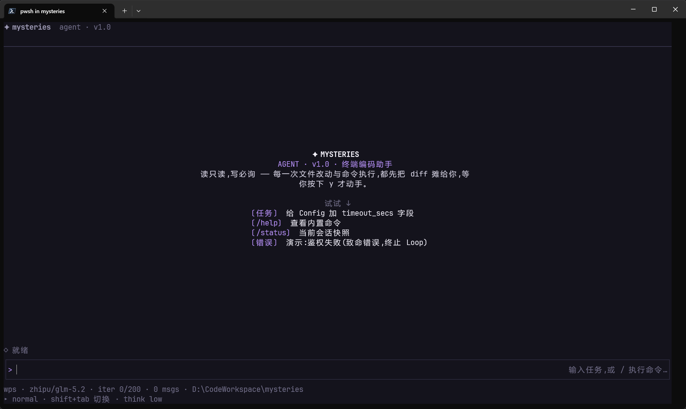
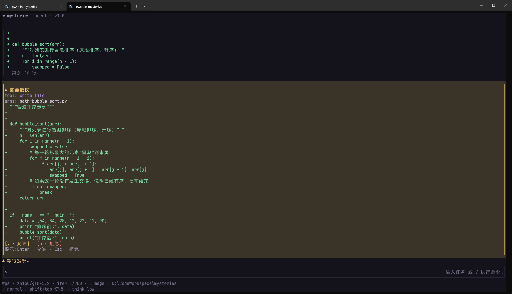
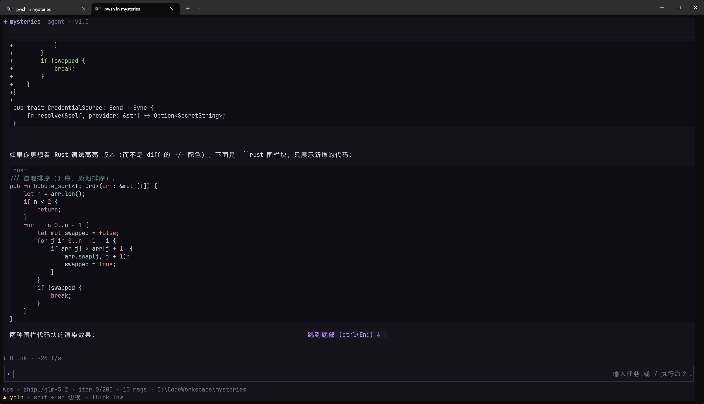
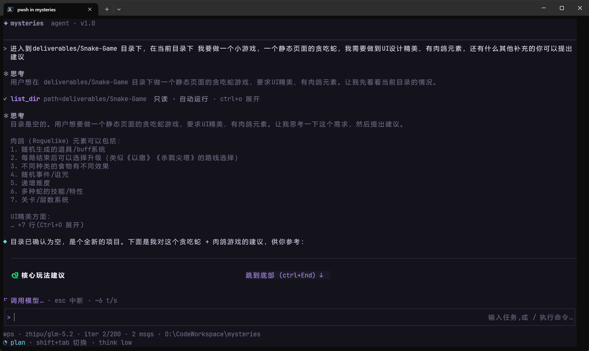
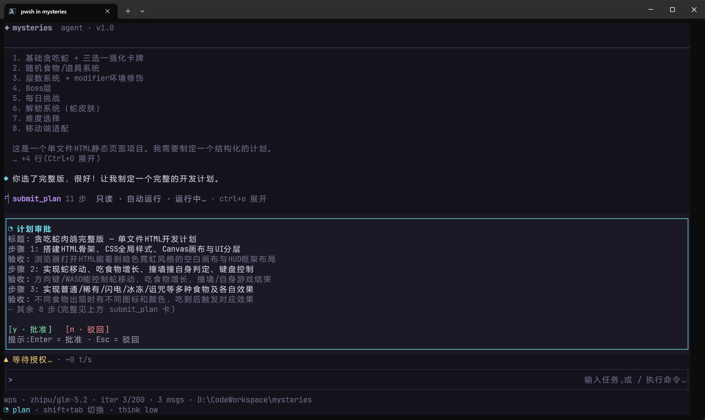
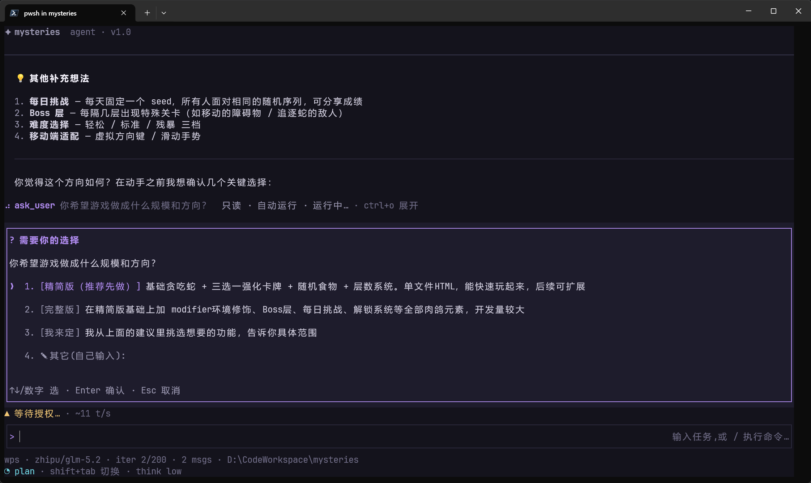
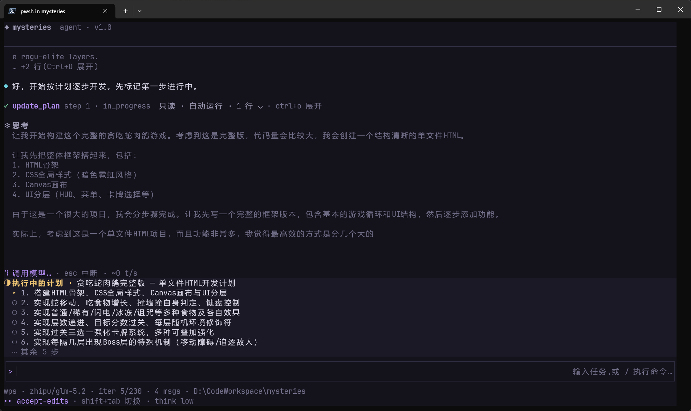
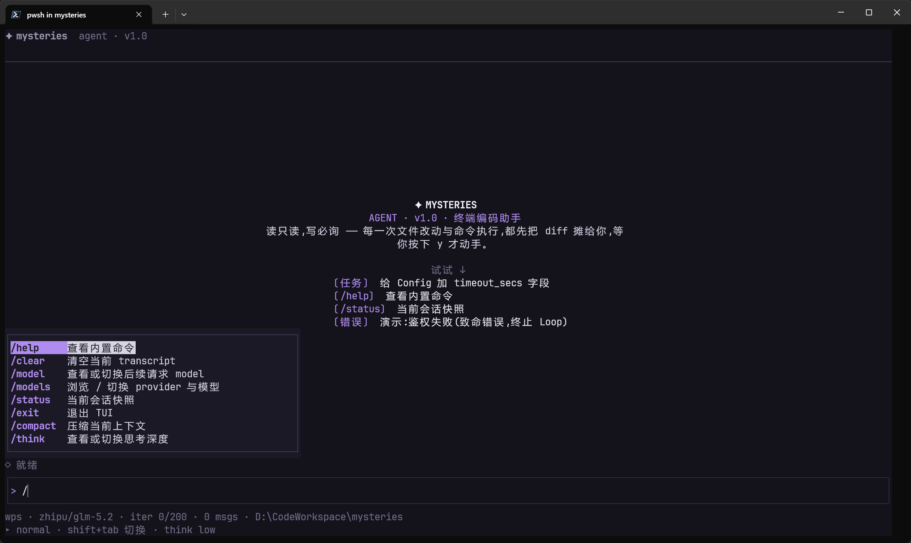
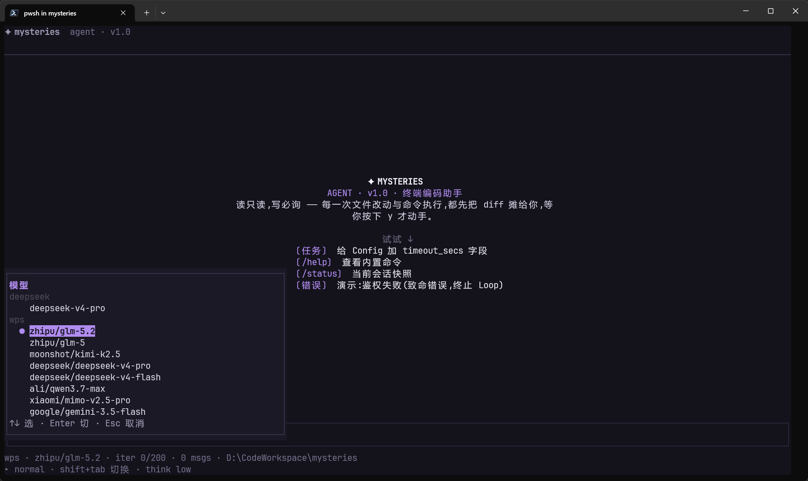

<div align="center">

# ✦ mysteries

**自研 terminal Agent CLI —— 在终端里对话驱动一个可调用本地工具的编码 agent(Claude Code 风格)**

[](LICENSE)
[](rust-toolchain.toml)
[](https://github.com/tajiaoyezi/mysteries/actions/workflows/ci.yml)
[](#-工程方法与质量)
[-blueviolet.svg)](#-架构总览)

</div>

> **核心能力(Agent Loop、工具系统、权限控制、会话管理)全部自行实现,不依赖任何第三方 Agent SDK / Framework**;协议接入、TUI、HTTP、语法高亮等用成熟三方库。

<div align="center">

</div>

## 理念:读只读,写必询

本地只读工具自动跑;**每一次网络调用、文件改动与命令执行,都先展示完整授权信息,等你明确允许才动手**。权限分四级、模式可切换,危险操作永远在你掌控内。

---

## 目录

- [✨ 特性](#-特性)
- [📸 界面一览](#-界面一览)
- [🚀 快速开始](#-快速开始)
- [⚙️ 配置](#️-配置)
- [⌨️ 键位与命令](#️-键位与命令)
- [🏗️ 架构总览](#️-架构总览)
- [🧪 工程方法与质量](#-工程方法与质量)
- [📐 设计文档](#-设计文档)
- [🤝 贡献](#-贡献)
- [📄 License](#-license)

## ✨ 特性

- **Agent Loop 自研**:模型决策 → tool_calls 过权限门 → 执行回传 → 续推;自v1.3.0起,每次 run 具有内核级 execution scope,可标识、可取消,并以 iteration/deadline/depth 预算及工具/权限 capability 上限阻止派生 run 扩权;Esc 中断由 Loop 统一收口 history,Provider 回复前中断的未提交 Prompt 不会污染下一轮模型上下文。同一回复中连续的本地读取 / 搜索(`list_dir` / `read_file` / `glob` / `grep`)与只读委派可进入既有上限 4 的有界安全段;变更 / 执行 / Network / 交互工具仍串行屏障,权限语义不变。
- **单层只读委派(v1.3.0)**:`delegate_task`为每个 occurrence 创建临时child Agent,只暴露`list_dir` / `read_file` / `glob` / `grep`,并把读取限制在canonical workspace root内（包括目录walker加载的parent、`.ignore`与`.gitignore`规则文件）;无递归、后台任务、child session、写入或Network child。outer同时active的child最多4个,这不是单轮调用总量上限;每个child最多8次tool-enabled Provider调用,触顶后至多再发1次forced-final,且从调用开始共用120秒总wall-clock。成本最坏放大为`delegate occurrence数 × 最多9次Provider调用`。
- **内置工具**:`list_dir` / `read_file` / `glob` / `grep` / `delegate_task`(单层只读委派)/ `write_file` / `edit_file`(唯一匹配替换)/ `run_shell` + 联网 `web_fetch` / `web_search`(SSRF 护栏)+ Plan 三件 `submit_plan` / `update_plan` / `ask_user`。
- **四级权限 × 四种模式**:工具按 `ReadOnly/Network/Edit/Execute` 分级;`Normal / AcceptEdits / Yolo / Plan` 经 Shift+Tab 循环。有效 Network preview 在 Normal/AcceptEdits/Plan 下逐次确认,Yolo 仅自动放行可授权 preview;未知或畸形 Network 调用始终拒绝。命令白名单 + always-allow 仅适用于 Execute。
- **Plan 模式**:先只读调研 → 交出带每步验收的结构化计划 → 你批准后逐步执行,常驻进度面板实时上报。
- **思考模式**:`Depth`(off/low/medium/high/xhigh)统一抽象,映射到 Anthropic adaptive+effort 与 OpenAI `reasoning_effort`;`/think` 切换;思考过程 TUI 折叠展示。
- **多 Provider**:OpenAI 兼容(含 WPS AI / DeepSeek 等)/ Anthropic / Mock,统一 `Provider` trait + registry,`/models` 运行时热切换,流式解析自实现,支持 socks5 代理。
- **上下文管理**:`ContextStrategy`(Passthrough / Compacting),超限自动压缩,token 用量实时显示。
- **会话持久化**:jsonl 快照 + `--resume` 续最近 + 会话选择器 + Ctrl+C 双击退出守卫。
- **精致 TUI**(ratatui + crossterm,Midnight/Daylight 双主题):Assistant markdown 渲染(syntect 语法高亮 + 简易表格 CJK 对齐)、工具卡 diff 高亮、大粘贴折叠、消息排队(两级取消)、多行输入、鼠标拖选复制、滚轮、输入历史、`/` 命令补全、jump-to-bottom。

> `delegate_task`当前没有per-response occurrence硬上限、跨child token总预算或child-only扫描字节硬上限。四个本地fs工具仍保留既有语义并先完成文件读取 / 目录遍历 / 匹配收集；其中`read_file`与`grep`再按`max_output_bytes`后置截断，`list_dir`与`glob`的既有输出没有该硬上限。因此active child≤4和单child 8+1轮限制不能解释为总token、总输出、总扫描量或总内存的固定上界。

## 📸 界面一览

**读只读、写必询** —— 写文件/执行命令前先摊 diff、等你按 `y`;Assistant 输出走 markdown 渲染 + syntect 语法高亮:

| 权限确认(diff + y/n) | markdown 代码语法高亮 |
|---|---|
|  |  |

**Plan 模式** —— 先只读调研、交结构化计划、批准后逐步执行:

| Plan:思考 + 工具卡 + markdown | 计划审批 |
|---|---|
|  |  |

| `ask_user` 澄清选型 | 执行中进度面板 |
|---|---|
|  |  |

**更多** —— `/` 命令补全、`/models` 热切换:

| 命令补全 | 模型热切换 |
|---|---|
|  |  |

## 🚀 快速开始

### 下载 GitHub Release（推荐）

先从公开 [latest stable Release](https://github.com/tajiaoyezi/mysteries/releases/latest) 解析真实 tag，再由该 tag 派生对应平台的 versioned archive、`SHA256SUMS`、解压目录与版本检查。下面的命令不需要 GitHub credential。

Windows PowerShell：

```powershell
$Release = Invoke-RestMethod 'https://api.github.com/repos/tajiaoyezi/mysteries/releases/latest'
$Tag = [string]$Release.tag_name
if ($Tag -notmatch '^v(0|[1-9]\d*)\.(0|[1-9]\d*)\.(0|[1-9]\d*)$') { throw 'latest stable tag 格式异常' }
$Version = $Tag.Substring(1)
$Asset = "mysteries-v$Version-x86_64-pc-windows-msvc.zip"
$Base = "https://github.com/tajiaoyezi/mysteries/releases/download/$Tag"
Invoke-WebRequest "$Base/$Asset" -OutFile $Asset
Invoke-WebRequest "$Base/SHA256SUMS" -OutFile SHA256SUMS
$Matches = @(Get-Content SHA256SUMS | Where-Object { $_ -match "^[0-9a-f]{64}  $([regex]::Escape($Asset))$" })
if ($Matches.Count -ne 1) { throw 'SHA256SUMS 记录缺失或重复' }
$Expected = ($Matches[0] -split '\s+')[0]
if ((Get-FileHash $Asset -Algorithm SHA256).Hash.ToLowerInvariant() -ne $Expected) { throw 'SHA-256 不匹配' }
$Directory = "mysteries-$Tag"
if (Test-Path -LiteralPath $Directory) { throw "解压目录已存在: $Directory" }
Expand-Archive $Asset -DestinationPath $Directory
$ActualVersion = (& "./$Directory/mysteries.exe" --version | Out-String).Trim()
if ($LASTEXITCODE -ne 0 -or $ActualVersion -ne "mysteries $Version") { throw "--version 不匹配: $ActualVersion" }
$ActualVersion
```

GNU/Linux：

```bash
latest_url="$(curl -fsSL -o /dev/null -w '%{url_effective}' https://github.com/tajiaoyezi/mysteries/releases/latest)"
tag="${latest_url##*/}"
[[ "$tag" =~ ^v(0|[1-9][0-9]*)\.(0|[1-9][0-9]*)\.(0|[1-9][0-9]*)$ ]]
version="${tag#v}"
asset="mysteries-v${version}-x86_64-unknown-linux-gnu.tar.gz"
base="https://github.com/tajiaoyezi/mysteries/releases/download/$tag"
curl -fL --retry 3 -O "$base/$asset"
curl -fL --retry 3 -O "$base/SHA256SUMS"
checksum_line="$(
  awk -v asset="$asset" '$2 == asset { count++; line=$0 } END { if (count != 1) exit 1; print line }' SHA256SUMS
)"
printf '%s\n' "$checksum_line" | sha256sum --check --strict
directory="mysteries-$tag"
mkdir "$directory"
tar -xzf "$asset" -C "$directory"
actual_version="$("./$directory/mysteries" --version)"
test "$actual_version" = "mysteries $version"
printf '%s\n' "$actual_version"
```

GNU/Linux 预编译包的支持基线为 x86_64、glibc 2.35-compatible（Ubuntu 22.04 或更新的兼容环境）。更老的 glibc 或 musl 环境请从源码构建。

### 从源码构建

```bash
cargo build --release         # 二进制产出在 target/release/mysteries(.exe)
cargo install --path .        # 安装到 ~/.cargo/bin,让 mysteries 全局可用(推荐)

mysteries auth login          # 交互式配置 provider + API Key
mysteries                     # 进入 TUI
mysteries --headless "解释一下 src/agent 的结构"   # 无头单轮模式
```

> 不想全局安装,也可直接用构建产物或 `cargo run`:
> ```bash
> ./target/release/mysteries auth login
> cargo run --release -- --headless "..."
> ```

无论使用 Release asset 还是源码构建，首次运行若未配置都会自动进入 onboarding。

## ⚙️ 配置

| 文件 | 位置 | 说明 |
|------|------|------|
| 用户配置 | `~/.config/mysteries/config.toml` | provider profiles、默认 model、Agent 行为等 |
| 项目配置 | `./mysteries.toml` | 同结构,**项目优先**合并 |
| 凭据 | `~/.config/mysteries/credentials` | `mysteries auth login` 写入;env 变量优先 |

配置模板见 [`mysteries.example.toml`](mysteries.example.toml)(含各字段注释)。

## ⌨️ 键位与命令

| 键 | 行为 |
|----|------|
| `Enter` | 提交(粘贴突发批内的 Enter 自动视为换行) |
| `Ctrl+Enter` / `Shift+Enter` / `Ctrl+J` | 插入换行 |
| `↑` / `↓` | 多行内移动光标;首/末行翻输入历史 |
| `Esc` | 关浮层 > 清选区 > 排队两级取消 > 中断本轮 |
| `Shift+Tab` | 权限模式循环(Normal / AcceptEdits / Yolo / Plan) |
| `Ctrl+O` | 展开/折叠工具卡与思考过程 |
| `Ctrl+Home` / `Ctrl+End` | transcript 顶 / 底 |
| 鼠标拖选 → 松开或 `Ctrl+C` | 复制选区 |

斜杠命令:`/help` `/clear` `/model [name]` `/models` `/status` `/compact` `/think [off\|low\|medium\|high\|xhigh]` `/exit`。

## 🏗️ 架构总览

| 模块 | 路径 | 职责 |
|------|------|------|
| Agent Loop | `src/agent/` | 核心决策循环:模型调用 → 工具执行 → 结果回传 → 续推;execution scope 提供 run identity、cancellation、预算和不可扩权 capability;Observer 事件外发;上下文压缩 |
| Provider | `src/provider/` | `Provider` trait + OpenAI/Anthropic/Mock 接入、流式解析、registry 热切换、模型能力表 |
| Tool 系统 | `src/tool/` | `Tool` trait + `ToolRegistry`,内置工具按 `PermissionLevel` 分级(fs / shell / web / plan / ask) |
| Permission | `src/permission/` | 权限门:本地只读放行,Network/写/执行经 `PermissionDecider` 确认;Network preview fail-closed;四种模式 + Execute 命令白名单 |
| Config | `src/config/` | 用户级 + 项目级合并(项目优先) |
| Credential | `src/credential/` | API Key 凭据链(env → 文件),`secrecy` 包裹 |
| Session | `src/session/` | jsonl 会话持久化 + resume |
| TUI | `src/tui/` | ratatui 外壳:双 task + channel 架构,markdown / diff / 思考折叠 / 输入 / 排队 / 选区 |
| CLI | `src/cli.rs` | `--headless` 无头模式、`auth list/login/logout` |
| 装配 | `src/app.rs` | provider 选择与 agent 组装 |

**TUI 运行时**:agent task 跑 `Agent::run`,UI task 渲染 + 事件;经 `UserInput` / `AgentEvent` 两条 channel 通信,中断走独立信号。事件循环对 crossterm 事件**批量 drain**(整批单次渲染),是粘贴防误提交与折叠的地基。

`web_fetch` / `web_search` 在 TUI 和 `--headless` 中都会展示完整参数、canonical initial target 与本次调用的 redirect/SSRF scope。授权只覆盖当前 ToolCall;SSRF 对初始 URL 和每跳 redirect 始终强制,Yolo 也不能绕过。Provider 自身访问模型 API 的 transport 不属于 Tool permission gate。

## 🧪 工程方法与质量

- **OpenSpec 流程**:每个变更 propose(proposal/design/tasks/spec delta)→ apply → archive。已归档 **65 个 change**,20 个能力域 spec 沉淀在 `openspec/specs/`(RFC 2119 风格),每个 change 附一条决策记录到 `.ai_history/logs/`。
- **TDD**:内核(Loop / 工具 / 权限 / Provider 归一化 / 配置 merge)强制先测后码、红灯独立成步;TUI 外壳走 `TestBackend` + `insta` 快照事后回归。
- **当前**:**800+ tests 全绿**(lib 单测 + e2e 集成)、`clippy -D warnings` 零警告、行覆盖 **~91%**(llvm-cov;内核如 Agent Loop 99%、工具 96–100%)。
- **构建 CI**(`.github/workflows/ci.yml`):Windows + Linux 上强制 `fmt --check` + `clippy -D` + **全量 `cargo test --locked`** + release build。
- **TUI 依赖面**:`ratatui 0.30` 关闭 defaults，只启用 `crossterm_0_29` + `layout-cache`；直接 `crossterm` 同步为单一 0.29，移除旧 `paste` 与受 `RUSTSEC-2026-0002` 影响的 `lru 0.12.5` 路径。
- **依赖安全 CI**(`.github/workflows/security-audit.yml`):独立 Ubuntu job 在每个 PR、`master` push、每周 schedule 与手动触发时，用固定 `cargo-audit` 和最新 RustSec database 扫描已提交的 `Cargo.lock`；任一 vulnerability、kind=`unsound` warning 或审计基础设施错误 hard-fail。当前门禁为 0 vulnerability / 0 unsound，但仍如实展示允许的 `bincode` unmaintained warning，不宣称 warning-free。

```bash
cargo test --locked                              # 全量(含集成测试)
cargo clippy --all-targets --locked -- -D warnings # 零警告基线
cargo build --release --locked
cargo-audit audit --deny unsound --file Cargo.lock # 0 vulnerability / 0 unsound;unmaintained 如实保留
cargo llvm-cov --summary-only                    # 覆盖率(需 cargo-llvm-cov)
```

## 📐 设计文档

本项目从需求到实现有完整的设计沉淀:

- [`需求文档/`](需求文档/) —— 开发需求文档
- [`技术方案/`](技术方案/) —— 技术方案(架构 / 并发模型 / 里程碑)
- [`设计规范/`](设计规范/) —— 把 web 原型蒸馏为可引用、可验证的 text 设计契约(设计令牌 / 布局交互 / 组件清单 + 原型截图)
- [`UI设计/`](UI设计/) —— Midnight / Daylight 双主题 HTML 原型稿
- [`deliverables/`](deliverables/) —— 可运行的验证产物(截图、由 mysteries 生成的 [Snake-Rogue demo](deliverables/Snake-Game/))

## 🤝 贡献

见 [CONTRIBUTING.md](CONTRIBUTING.md)。项目对 OpenSpec 流程、TDD、提交规范有明确约定,请动手前阅读。

## 📄 License

[MIT](LICENSE) © 2026 wanglei30
