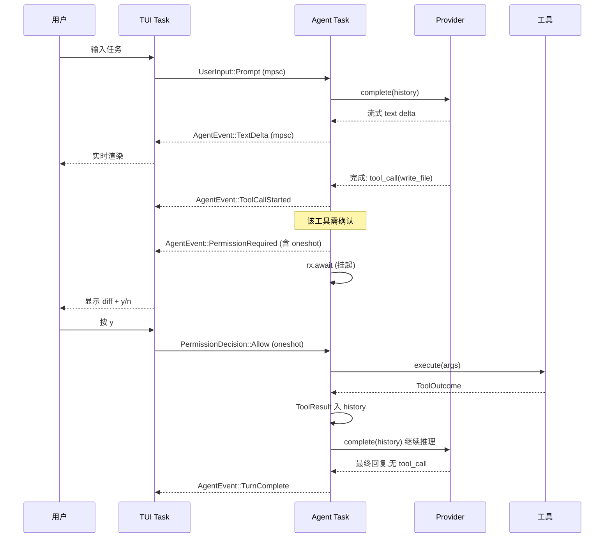
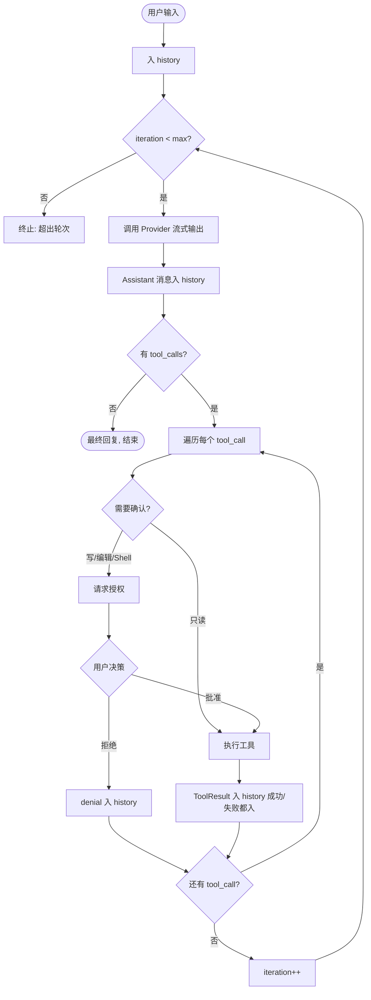

# Mysteries Agent — 技术方案

> TUI 终端编码 Agent · Rust 实现 · 1.0 MVP 技术设计基线

本文档是 1.0 的工程蓝图,同时标注 1.x→2.0 的扩展缝(seam),确保 1.0 的抽象不会把后续路线图逼进死角。文中 `【决策】` 标记的是有取舍的判断,可针对性反驳;其余为需求映射或既定结论。

---

## 1. 设计原则

四条原则,后续所有结构都从这里推导:

1. **Headless 内核,TUI 是一层外壳。** Agent Loop、工具系统、权限门、Provider 抽象全部 IO 无关。TUI 只是众多前端中的一个(测试用的是 stdin/stdout 或直接驱动内核)。这条决定了整个 crate 的依赖方向:`core` 不依赖 `tui`,`tui` 依赖 `core`。

2. **并发边界显式化。** LLM 流式是 async,TUI 有自己的事件循环,权限确认要把 Agent Loop 挂起等用户决策。这三者在 Rust 里的协调方式(两个 task + channel)是整个程序最该先钉死的结构,见 §3。

3. **协议归一化在内核,不在调用点。** OpenAI 与 Anthropic 是两套线格式(wire format),本地模型可能连原生 function calling 都没有。统一收敛到一个内部 `ModelResponse`,Agent Loop 只面对归一化后的类型。

4. **1.0 即把扩展缝留好,但不实装。** 凭据来源、上下文策略、权限策略、工具注册表都设计成"可替换实现",1.0 只放最简单的那个实现。见 §13。

---

## 2. 整体架构

```
┌─────────────────────────────────────────────────────────┐
│                      前端层 (Frontend)                     │
│   TUI Task: ratatui 渲染 + crossterm 异步事件流            │
└───────────────▲───────────────────────────┬─────────────┘
                │ AgentEvent (mpsc)          │ UserInput (mpsc)
                │ ← 流式token/工具/状态/权限   │ → 输入/命令
┌───────────────┴───────────────────────────▼─────────────┐
│                   核心层 (Core, headless)                  │
│  ┌──────────────────────────────────────────────────┐   │
│  │                  Agent Loop                        │   │
│  │  请求→解析→工具→回填→再请求 / 终止                  │   │
│  └────┬──────────┬───────────┬──────────────┬────────┘   │
│       │          │           │              │            │
│  ┌────▼───┐ ┌────▼─────┐ ┌──▼──────┐ ┌─────▼────────┐   │
│  │Session │ │Permission│ │  Tool   │ │   Provider    │   │
│  │/History│ │  Gate    │ │Registry │ │  (trait)      │   │
│  └────────┘ └──────────┘ └─────────┘ └──┬───┬───┬───┘   │
│                                          │   │   │        │
└──────────────────────────────────────────┼───┼───┼───────┘
                                     OpenAI │   │   │ Mock
                                  compatible │   │ Anthropic
                              (含本地/自定义) ▼   ▼   ▼
```

**层级与依赖方向**:`frontend → core → provider`,单向。core 通过两个 trait(`Provider`、`Tool`)与外部世界解耦,因此 Mock 化、替换实现、单测全部不需要真实 IO。

---

## 3. 并发模型与事件流(核心)

【决策】**两个 tokio task,channel 通信。** TUI 一个 task,Agent 一个 task,杜绝把渲染和推理塞进同一个循环。这是 Rust 相对 Go 在本题上唯一的硬骨头——goroutine+channel 随手能解的事,这里所有权和生命周期会逼你先想清楚边界。

通道契约:

```rust
// Agent → UI:单向、被 UI task 独占消费,故不需要 Clone
enum AgentEvent {
    UserEchoed(String),
    TextDelta(String),                 // 流式 token,逐段刷
    TextDone,
    ToolCallStarted { id: String, name: String, args: serde_json::Value },
    ToolCallFinished { id: String, outcome: ToolOutcome },
    PermissionRequired(PermissionRequest), // 内含 oneshot::Sender,见下
    StatusChanged(AgentStatus),
    Error(String),
    TurnComplete,
}

// UI → Agent
enum UserInput {
    Prompt(String),
    Command(SlashCommand),
}

// 实时活动状态,驱动状态行(与 /status 快照是两回事)
enum AgentStatus {
    Idle,
    CallingModel,
    ExecutingTool(String),
    WaitingForPermission,
}
```

**权限的挂起-恢复是这套设计的关键。** 权限请求携带一个 `oneshot::Sender<PermissionDecision>`,Agent task 发出请求后在 `rx.await` 处自然挂起,UI 渲染确认框,用户按键后把决策从 oneshot 送回,Agent task 恢复:

```rust
struct PermissionRequest {
    tool_name: String,
    args: serde_json::Value,
    preview: PermissionPreview,        // 写/编辑时携带 diff
    responder: oneshot::Sender<PermissionDecision>,
}
enum PermissionDecision { Allow, Deny }
```

> 注意:`oneshot::Sender` 不是 `Clone`,所以 `AgentEvent` 整体不能 derive `Clone`——这正好,它本就被单一 UI task 消费,无需 Clone。

单轮交互(含权限)的完整时序:



**TUI task 的事件循环**用 `tokio::select!` 同时等两路:Agent 事件 与 crossterm 异步键盘事件(`crossterm` 开 `event-stream` feature 后可拿到 `Stream`):

```rust
loop {
    tokio::select! {
        Some(ev) = agent_rx.recv()      => app.apply(ev),
        Some(Ok(key)) = term_events.next() => app.on_key(key),
    }
    terminal.draw(|f| render(f, &app))?;
}
```

---

## 4. 模块划分

```
src/
  main.rs              # 入口:clap 解析、加载 config、装配 core、spawn 两个 task
  config/
    mod.rs             # Config 结构、分层加载与字段级 merge
    schema.rs          # serde 结构定义
  provider/
    mod.rs             # Provider trait、ModelRequest/ModelResponse、ToolCall
    openai.rs          # OpenAI 兼容实现(base_url 可配 = 自定义/本地)
    anthropic.rs       # Anthropic 实现
    mock.rs            # Mock Provider(脚本化,供测试)
    wire.rs            # 两套线格式 ↔ 内部 Message 的归一化
    stream.rs          # SSE 解析与流式累积
  agent/
    mod.rs             # Agent Loop 主控
    session.rs         # Session:消息历史 + 元数据(已 serde-ready)
    message.rs         # 内部规范 Message(6 类事件)
    context.rs         # ContextStrategy(1.0 直通+截断;1.1 压缩接此)
  tool/
    mod.rs             # Tool trait、ToolRegistry、PermissionLevel、ToolOutcome
    fs.rs              # list_dir / read_file / glob / grep
    edit.rs            # write_file / edit_file
    shell.rs           # run_shell
  permission/
    mod.rs             # 权限门:1.0 总是询问;1.3 PolicyEngine 接此
  credential/
    mod.rs             # CredentialSource trait + 链:env、file;OAuth 留位
  tui/
    app.rs render.rs input.rs widgets/   # 渲染、状态、确认框、transcript
  command/
    mod.rs             # slash 命令解析与分发
  error.rs             # thiserror 类型化错误
```

---

## 5. 核心抽象

### 5.1 Provider 与协议归一化

`Box<dyn Provider>` 需要 trait object,故用 `#[async_trait]`(native AFIT 暂不支持 dyn)。

```rust
#[async_trait]
trait Provider: Send + Sync {
    fn name(&self) -> &str;
    async fn complete(
        &self,
        req: ModelRequest,
        sink: &dyn DeltaSink,          // 流式 token 出口,解耦于 UI channel
    ) -> Result<ModelResponse, ProviderError>;
}

trait DeltaSink: Send + Sync {        // Agent 提供 forwarding 实现;Mock 用 no-op
    fn on_text(&self, delta: &str);
}

struct ModelRequest {
    model: String,
    messages: Vec<Message>,           // 内部规范格式,见 5.5
    tools: Vec<ToolSchema>,
    max_tokens: Option<u32>,
}

struct ModelResponse {
    text: String,
    tool_calls: Vec<ToolCall>,        // 已归一化,Loop 不关心来源协议
    finish_reason: FinishReason,
}

struct ToolCall { id: String, name: String, arguments: serde_json::Value }
```

【决策】**流式出口用 `DeltaSink` 而非把 `ui_tx` 灌进 provider。** Provider 不该知道 UI channel 的存在;Agent 装配一个把 `on_text` 转成 `AgentEvent::TextDelta` 的 sink。Mock 在测试里传 no-op sink,零 IO。

**归一化要处理的四处差异**(这一步即需求里的"工具调用解析"):

| 维度 | OpenAI 兼容 | Anthropic |
|---|---|---|
| 工具调用表示 | assistant 消息上的 `tool_calls[]` | `tool_use` content block |
| 工具结果回传 | `role: "tool"` + `tool_call_id` | `user` 消息内的 `tool_result` block |
| System prompt | `role: "system"` 消息 | 顶层 `system` 参数 |
| 流式工具增量 | `delta.tool_calls`(带 index) | `content_block_delta` / `input_json_delta` |

每个 Provider 实现 `wire::serialize(&[Message]) -> WireBody` 与响应解析,内核只见 `Message` / `ModelResponse`。

**本地模型兜底**:OpenAI 兼容端点(Ollama / llama.cpp)可能不支持原生 function calling。`OpenAiProvider` 带一个 `tool_mode` 开关:原生 `tools` 参数,或退化为在 system prompt 里注入工具定义 + 要求模型输出约定 JSON,再解析。1.0 默认原生,留好降级路径。

### 5.2 流式与工具调用累积

【决策】**tool_calls 增量到达,累积到流结束再解析执行,不做"边流边执行 partial tool call"。** SSE 逐 chunk 解码:文本 delta 即时经 sink 推给 UI;工具调用片段(可能跨多个 chunk,OpenAI 按 index 聚合,Anthropic 累积 `input_json_delta`)在内存里拼,流 `[DONE]` / `message_stop` 后整体落成 `ToolCall`。超时由 `tokio::time::timeout` 包裹整个 `complete`;重试针对 429/5xx/网络错误做指数退避。

### 5.3 Tool 与注册表

```rust
#[async_trait]
trait Tool: Send + Sync {
    fn name(&self) -> &str;
    fn description(&self) -> &str;
    fn schema(&self) -> serde_json::Value;     // 喂模型的 JSON Schema
    fn permission_level(&self) -> PermissionLevel;
    async fn execute(&self, args: serde_json::Value, ctx: &ToolContext) -> ToolOutcome;
}

enum PermissionLevel { ReadOnly, RequiresConfirmation }

struct ToolOutcome {
    content: String,
    is_error: bool,        // 失败也是结构化结果,照样入 history 供模型自纠
    truncated: bool,       // 是否触发输出上限
}

struct ToolContext {
    cwd: PathBuf,
    max_output_bytes: usize,   // read/grep/shell 输出上限,防 context 撑爆
}

struct ToolRegistry { tools: HashMap<String, Box<dyn Tool>> }
```

**1.0 的 7 个工具**(一类一个):

| 工具 | 类别 | 权限 | 实现要点 |
|---|---|---|---|
| `list_dir` | 浏览 | ReadOnly | `ignore` crate,gitignore 感知 |
| `read_file` | 读取 | ReadOnly | 带 `offset`/`limit` 分页,输出截断 |
| `glob` | 文件匹配 | ReadOnly | `globset` |
| `grep` | 内容搜索 | ReadOnly | `ignore` 遍历 + `regex`,结果行数上限 |
| `write_file` | 写入 | RequiresConfirmation | 新建/覆盖,确认时显示 diff |
| `edit_file` | 编辑 | RequiresConfirmation | str-replace,要求唯一匹配,否则报错 |
| `run_shell` | 执行 | RequiresConfirmation | `tokio::process`,捕获 stdout/stderr/exit + timeout |

### 5.4 权限门

```rust
// 1.0:只读直跑;写/编辑/Shell 走 oneshot 询问。
// 1.3 的 PolicyEngine(allowlist/风险分级/always-allow)接在 ask 之前。
async fn gate(
    call: &ToolCall, tool: &dyn Tool, ui_tx: &Sender<AgentEvent>,
) -> PermissionDecision {
    if tool.permission_level() == PermissionLevel::ReadOnly {
        return PermissionDecision::Allow;
    }
    let (tx, rx) = oneshot::channel();
    ui_tx.send(AgentEvent::PermissionRequired(PermissionRequest {
        tool_name: call.name.clone(),
        args: call.arguments.clone(),
        preview: build_preview(call),   // 写/编辑生成 diff
        responder: tx,
    })).await.ok();
    rx.await.unwrap_or(PermissionDecision::Deny)   // 通道断 = 拒绝,fail-safe
}
```

拒绝时,把一条 `is_error` 的 `ToolResult`("user denied")注入 history,模型据此改路线——静默跳过是这类项目最常见的错。

### 5.5 Session 与规范 Message

```rust
enum Message {                       // 内部规范格式,各 Provider 序列化到各自线格式
    System(String),
    User(String),
    Assistant { text: String, tool_calls: Vec<ToolCall> },
    ToolResult { call_id: String, content: String, is_error: bool },
}

#[derive(Serialize, Deserialize)]    // 1.0 不落盘,但 1.2 持久化直接复用
struct Session {
    id: String,
    cwd: PathBuf,
    messages: Vec<Message>,
    model: String,
}
```

需求要求的 6 类事件全部映射进 history:用户输入→`User`;模型回复→`Assistant.text`;工具调用→`Assistant.tool_calls`;工具结果→`ToolResult`;权限拒绝→`ToolResult{is_error}`;错误→同样落成 `ToolResult{is_error}` 或独立错误消息。**每轮请求带完整 history**,这就是需求里的"多轮会话上下文"。

### 5.6 凭据来源(认证预留)

```rust
trait CredentialSource: Send + Sync {
    fn resolve(&self, provider: &str) -> Option<SecretString>;  // secrecy crate
}
struct EnvCredentialSource;       // OPENAI_API_KEY / ANTHROPIC_API_KEY ...
struct FileCredentialSource;      // 凭据文件(建议 chmod 600)
// struct OAuthCredentialSource;  // 2.0 落地,1.0 仅留接口位

struct CredentialChain(Vec<Box<dyn CredentialSource>>);  // env 优先,再 file
```

`SecretString` 的 `Debug` 自动脱敏,从类型层面满足"API Key 不得暴露、不入日志"。`/login`/`/logout` 为 1.0 占位命令(调用即提示"当前版本请用 config / 环境变量配置")。

---

## 6. Agent Loop 详解



**终止条件**:① 模型返回无 `tool_calls` = 最终回复;② `iteration >= max_iterations`(config 读)= 超轮次终止;③ 不可恢复错误(见 §9)= 终止。可恢复错误(工具失败、权限拒绝、单次 provider 重试范围内的失败)不终止,作为结果入 history 继续。

【决策】**1.0 同一轮的多个 tool_calls 顺序执行。** 并行留给 1.5。注意:**不得**仅按 `PermissionLevel::ReadOnly` 推断可并发——交互 / 计划工具也是 `ReadOnly` 却不能重叠。1.5 改为独立 `ToolConcurrency`(默认 `Exclusive`),仅显式 opt-in 的本地读取进入 work-conserving 有界安全段。

---

## 7. 配置系统

TOML,两层:user(`~/.config/<app>/config.toml`)+ project(`./<app>.toml` 或 `./.config.toml`)。

【决策】**字段级 merge,project 覆盖 user。** 用 `Option` 字段表达"未设置":加载 user → 加载 project → project 的 `Some` 覆盖 user 对应字段,`None` 继承。不是整文件替换,而是逐字段。

```rust
struct Config {
    provider: ProviderConfig,
    model: String,
    max_iterations: u32,
    timeout_secs: u64,
}
struct ProviderConfig {
    kind: ProviderKind,        // OpenAi | Anthropic | Mock
    base_url: Option<String>,  // 可配 = 自定义/本地 provider 的载体
    auth_type: AuthType,       // ApiKey(1.0 唯一);OAuth 字段占位
    // 注意:无 api_key 字段——凭据一律走 CredentialSource
}
```

---

## 8. TUI 层

ratatui + crossterm。布局自上而下:**顶栏(1 行,品牌标识)/ transcript(可滚动,占大部分高度)/ 状态行(1 行)/ 输入框(1–3 行)**;权限确认时,确认框内联于输入框上方(显示工具名 + diff + `[y/n]`)。顶栏据 UI 原型补入(见 `设计规范/` C1),只放品牌(`✦ mysteries agent · v1.0`);provider/model 不在顶栏重复,统一归状态行。

需求点名要"可见地渲染"工具调用过程与结果:transcript 中每个 tool call 渲染成可识别的块——调了哪个工具、参数摘要、result 的 stdout/exit/是否截断,不能只躺在内部 history。状态行实时反映**阶段**(`CallingModel` / `ExecutingTool(x)` / `WaitingForPermission` / `Idle`),与 `/status` 快照(provider·model·当前轮次·cwd·消息数)是两个东西,都要。

内置命令:`/help` `/clear` `/model [name]` `/status` `/exit` `/login` `/logout`(后两个占位)。

---

## 9. 错误处理

`thiserror` 定义库边界的类型化错误,`anyhow` 用于 main/装配层。关键是**区分可恢复与致命**:

- **可恢复 → 入 history,Loop 继续**:工具执行失败、权限拒绝、provider 单次失败但在重试预算内。
- **致命 → 终止 Loop,回 UI**:凭据缺失/鉴权失败、配置非法、超出 `max_iterations`、重试耗尽。

```rust
#[derive(thiserror::Error, Debug)]
enum ProviderError {
    #[error("auth failed")] Auth,            // 致命
    #[error("rate limited")] RateLimited,    // 触发重试
    #[error("timeout")] Timeout,             // 触发重试
    #[error("transport: {0}")] Transport(String),
}
```

---

## 10. 测试策略

Headless 内核让需求要求的 5 个测试范围全部无需 TUI:

1. **主循环**:`MockProvider` 脚本化返回序列(text → tool_call → 最终 text),驱动 Loop 跑完多轮,断言 history 与终止行为。
2. **工具调用与结果回传**:断言 `ToolCall` 被正确分发、`ToolOutcome` 正确落回 `ToolResult`。
3. **权限确认与拒绝**:注入 Allow/Deny 决策,验证拒绝路径产出 denial 消息且 Loop 继续。
4. **配置优先级**:user+project 两份 TOML,断言 project 字段覆盖。
5. **Mock Provider 场景**:本身即测试基础设施,顺带覆盖归一化(喂入两套线格式样例,断言归一化为同一 `ModelResponse`)。

```rust
struct MockProvider { script: Vec<ModelResponse>, cursor: AtomicUsize }
// complete() 按 cursor 依次吐 script,可断言收到的 ModelRequest
```

边界用例:`max_iterations` 守卫触发;工具输出超限时 `truncated=true`;`edit_file` 非唯一匹配报错;凭据缺失走致命路径。

---

## 11. Crate 选型

| 领域 | crate | 备注 |
|---|---|---|
| 异步运行时 | `tokio` | `rt-multi-thread, macros, sync, process, time` |
| TUI | `ratatui` + `crossterm` | crossterm 开 `event-stream` 取异步键盘流 |
| HTTP | `reqwest` | `json, stream, rustls-tls` |
| SSE | `eventsource-stream` | 或自解 SSE |
| 序列化/配置 | `serde` `serde_json` `toml` | |
| async trait | `async-trait` | dyn 化 Provider/Tool 必需 |
| 错误 | `anyhow` + `thiserror` | 应用层 / 库边界 |
| 目录遍历 | `ignore` | gitignore 感知,ripgrep 同款 |
| 匹配/搜索 | `globset` `regex` | |
| 密钥 | `secrecy` | `SecretString`,Debug 脱敏 |
| 日志 | `tracing` `tracing-subscriber` | |
| 参数 | `clap` | |
| 测试 | `tempfile` 等 | Mock Provider 自写,无需 HTTP mock |
| Token 计数 | `tiktoken-rs` | **1.1 引入**,非 1.0 |

---

## 12. 1.0 落地顺序

严格先内核后外壳,每步都可独立验证:

1. **Provider trait + OpenAI 兼容实现 + Mock**,纯 stdout 跑通单轮对话。
2. **Agent Loop + 工具系统**,headless,先上 read/list/shell,权限走 stdin y/n,把核心循环和测试做扎实(顺手加 max_iterations 守卫)。
3. **配置分层**(user + project,project 覆盖)+ 凭据链(env + file)。
4. **套 ratatui**,引入 §3 的双 task + channel 架构,把 stdin/stdout 替换为 TUI。
5. **收尾**:流式打磨 / 超时 / 重试 / 补齐 Anthropic provider / 内置命令 / diff 确认。

---

## 13. 面向 1.x→2.0 的扩展缝

1.0 不实装这些,但抽象已留好对应缝,后续是"换实现"而非"改架构"——这也是评审看重的自主设计能力:

| 路线图 | 扩展缝(1.0 已就位) | 1.x/2.0 接入方式 |
|---|---|---|
| **1.1 Token 压缩** | `agent/context.rs` 的 `ContextStrategy`,Loop 构造请求前过一遍 | 1.0 是直通+截断;1.1 换成计数+压缩 summary 的实现 |
| **1.2 持久化** | `Session` 已 `derive(Serialize)`,是天然落盘单元 | 加 `SessionStore` trait(file/sqlite);1.0 无实现 |
| **1.3 权限工效** | 权限门 `gate()` 已集中决策点 | 在 `ask` 前插 `PolicyEngine`(allowlist/风险分级/always-allow) |
| **1.4 TUI 体验** | 渲染隔离在 `tui/` | 纯加法:markdown 渲染、diff 高亮、折叠 |
| **1.5 并行工具** | 独立 `ToolConcurrency` + 默认 Exclusive;连续 ParallelSafe 段 work-conserving 有界并行(上限 4);Exclusive / Network / Edit / Execute / 交互为屏障 | 不按 ReadOnly 推断;已由通用 Agent execution scope 取代早期 TUI turn helper,Provider / permission / 串并行工具统一响应 cancellation |
| **1.3 execution scope** | 每次 run 有稳定 identity、parent→child cancellation、iteration/deadline/depth 预算与 capability 上限;受限 registry 共享 `Arc<dyn Tool>` | child scope 只能收紧预算、工具名与权限级,不能扩权;Provider 回复前取消会从后续模型history隔离未提交Prompt,但保留TUI transcript;取消只收口 Agent future/history/observer,不硬取消已进入 blocking pool 的 OS 工作 |
| **2.0 MCP** | `ToolRegistry` 内部持共享 `Arc<dyn Tool>`,注册边界仍接受 `Box<dyn Tool>` | MCP 工具可作为另一种 `Tool` 实现,代理到 MCP server;本阶段未实现 |
| **2.0 subagent** | Agent Loop 即可构造的单元(Session+Registry+Provider)+可派生 execution scope | child = 带独立 context 预算 + 受限 registry 的另一个 Loop;execution scope 只是前置安全基础,尚未实现 `delegate_task`、child scheduler、child session 或 subagent UI |
| **OAuth 登录** | `CredentialChain` 已是可扩展链 | 加 `OAuthCredentialSource`,配合 1.2 存 token |

---

**附:与需求文档的映射自检**——Agent Loop(§6)、6 类工具→7 工具(§5.3)、权限三态(§5.4)、双 wire format + 本地兼容(§5.1)、多轮历史 6 类事件(§5.5)、配置分层 project 覆盖 + key 不暴露(§7、§5.6)、流式/超时/重试/解析(§5.1–5.2)、5 内置命令(§8)、5 测试范围(§10)——需求硬要求逐条有落点。
